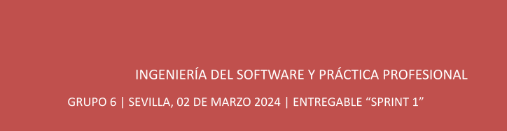
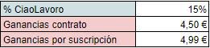
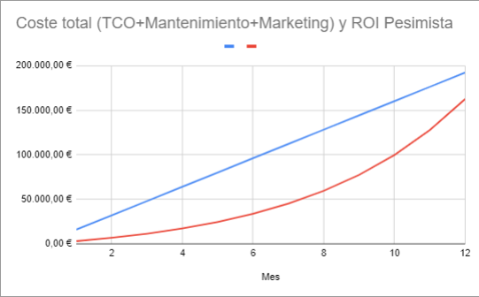
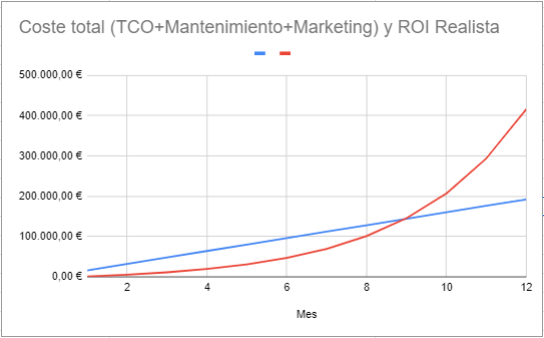
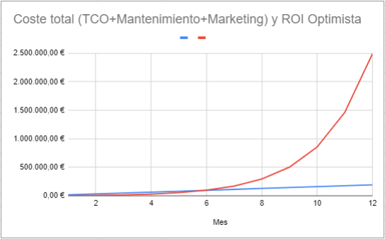
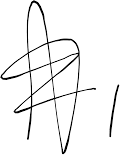

{width="1.0416666666666666e-2in"
height="1.0416666666666666e-2in"}{width="6.5625in"
height="3.125e-2in"}

Retorno de la Inversión

CiaoLavoro

> MIEMBROS DEL EQUIPO:
>
> -Alexander \| Alicia Sánchez Hossdorf - Álvaro Hidalgo Rodríguez
>
> \- Joaquín Arregui Díaz - Samuel Albalat Ortiz
>
> \- Adrián García Chavero - Pablo Cuenca Pérez
>
> \- Francisco Antonio Campos Campos - Javier Grosso
>
> \- José Luis Cobo Ariza
>
> \- Diego González Quintanilla - Antonio Barea Jiménez
>
> {width="7.541666666666667in"
> height="1.9791666666666667in"}{width="7.541665573053368in"
> height="0.17708333333333334in"}- Pablo Mateos Angulo
>
> **[ISPP Retorno de la inversión
> \_\_\_\_\_\_\_\_\_\_\_\_Grupo-6]{.underline}**{width="7.572916666666667in"
> height="0.28125in"}
>
> **CONTROL** **DE** **VERSIONES**

{width="2.71875in"
height="0.625in"}{width="4.531248906386701in"
height="2.8125in"}**[ISPP Retorno de la Inversión
\_\_\_\_\_\_\_\_\_\_\_\_Grupo-6]{.underline}**

> **[ISPP Retorno de la Inversión
> \_\_\_\_\_\_\_\_\_\_\_\_Grupo-6]{.underline}**{width="4.979166666666667in"
> height="3.09375in"}{width="5.0625in"
> height="3.1354166666666665in"}
>
> Imagen 3: ROI Realista = 116,17%
>
> En la imagen anterior podemos apreciar que a partir del 9º mes desde
> el lanzamiento de nuestra aplicación los beneficios(línea roja)
> superarían a los gastos(línea azul).
>
> \- ROI Optimista: Se espera que cada mes se hagan un 70% más de
> contratos y de suscripciones.
>
> Imagen 4: ROI Optimista = 1194,80%
>
> En la imagen anterior podemos apreciar que el crecimiento de los
> beneficios(línea roja) es exponencial, siendo así, como se indica, un
> ROI muy optimista pero poco realista.

En conclusión, el ROI Realista es el que mejor se ajusta a nuestra
aplicación, aunque se espera que los primeros meses de lanzamiento de
nuestra aplicación se produzcan pérdidas pero tras unos meses los
beneficios seguirán aumentando de manera significativa incluso habiendo
superado los gastos.

**[ISPP Retorno de la Inversión
\_\_\_\_\_\_\_\_\_\_\_\_Grupo-6]{.underline}**

> {width="1.3958333333333333in"
> height="0.8541666666666666in"}**APROBACIÓN**
